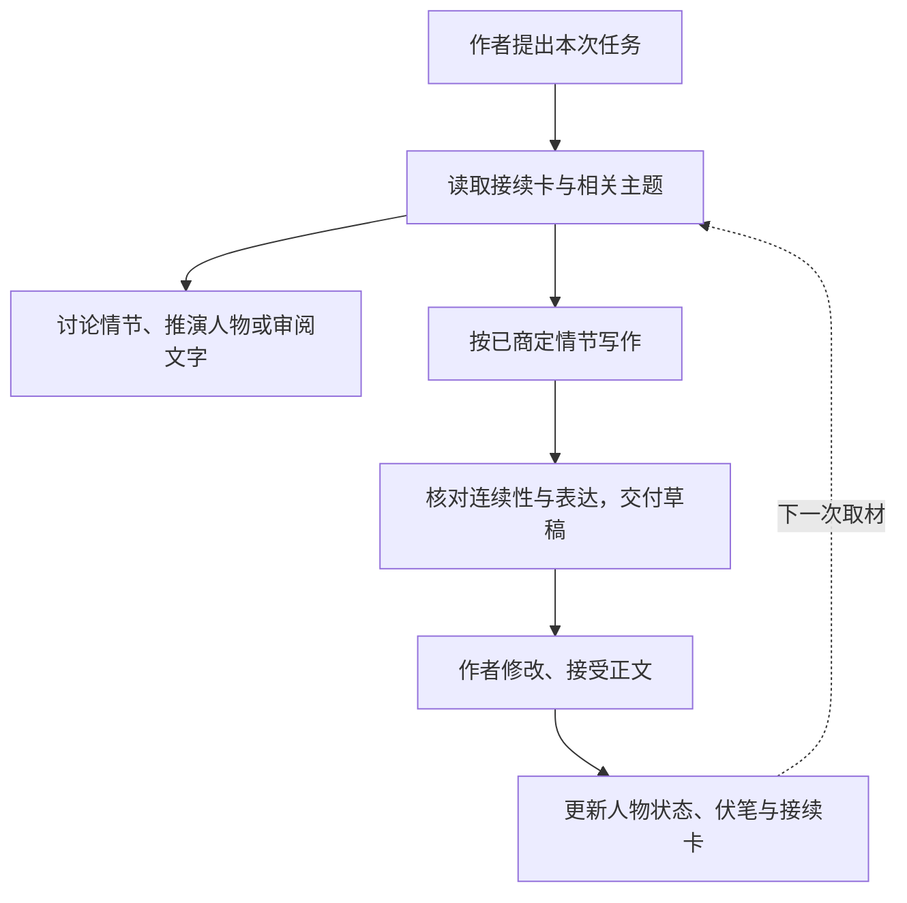

<div align="center">

# novel_skill-CN

**中文长篇小说协作 · 内置小说 humanizer**

[](LICENSE)
[](#本地检索)


[开始使用](#开始使用) · [运行机制](#运行机制) · [小说 humanizer](#小说-humanizer) · [来源和借鉴](#来源和借鉴)

</div>

用它和 AI 讨论情节、推演人物、写场景，也可以单独审阅或润色一段文字。人物档案、伏笔和章节状态保存在你的作品目录里，每次工作只取当前任务用得上的部分。

作者决定关键情节，助手负责把已商定的内容写出来。讨论过的方案、待改的草稿、已经接受的正文分别记录，避免还在考虑的情节在后面被当成事实。文风可以跟着作者的样本和修改意见逐步校准，人物对白则按各自的经历、关系和当下目的来写。

## 开始使用

### 安装到 Codex

把这个仓库完整放进 Codex 的用户级 skill 目录，文件夹命名为 `novel-coauthor-zh`。下方使用 [Codex 官方文档](https://learn.chatgpt.com/docs/build-skills#where-codex-loads-local-skills) 中的 `~/.agents/skills/` 目录。

**Windows / PowerShell**

```powershell
git clone https://github.com/AlexBybye/novel_skill-CN.git "$env:USERPROFILE/.agents/skills/novel-coauthor-zh"
```

**macOS / Linux**

```bash
git clone https://github.com/AlexBybye/novel_skill-CN.git ~/.agents/skills/novel-coauthor-zh
```

也可以下载仓库 ZIP，解压后将整个目录放到同一位置。保留目录内的参考文件和脚本；如果已有同名 skill，先保留旧版本，再替换。安装后使用 `$novel-coauthor-zh` 调用；若没有出现，重启 Codex 后再试。

Skill 本身没有模型密钥配置。只有使用本地检索脚本时才需要 Python 3.10 或更新版本；讨论和写作使用你当前助手的模型服务。

其他支持 `SKILL.md` 的助手可以按各自的安装方式加载这个目录。`agents/openai.yaml` 是 Codex 的界面配置，核心规则在 `SKILL.md` 和 `references/` 中；其他宿主的自动发现方式还需实际确认。

### 先试一次

单段文字可以直接贴进对话，不用建资料库。比如：

```text
使用 $novel-coauthor-zh 润色下面这段文字。
保留人物的误会和限知视角，只改表达，不扩写，只给终稿。

〔粘贴文字〕
```

写长篇时，在你的作品目录里打开助手，再按当下需要提出请求：

| 想做什么 | 可以这样说 |
|---|---|
| 讨论下一步 | 结合当前人物状态，讨论下一场怎么发展。先不写正文。 |
| 推演人物 | 他现在不知道真相，又想保护同伴，最可能怎样做？指出需要补足的动机。 |
| 查伏笔和连续性 | 核对这条线索已经写到了哪一步，区分已埋、计划和已回收。 |
| 写场景 | 按刚才选定的方案写这一场，停在我们商定的位置。 |
| 审阅文字 | 看看这段对白是否符合人物，只指出问题，不修改文件。 |
| 改文风 | 参考这两段我认可的文字调整旁白，人物对白仍按各自口吻写。 |

已有正文、设定和笔记时，也可以直接说：“按现有资料整理小说工作区，保留原文件。”由助手建立接续卡和配置，你只需确认故事里的事实与方向。

## 运行机制

长篇资料多起来以后，关键是让助手分清：哪些事已经发生，哪些还在计划；谁知道真相，谁只是猜测；这次写作究竟需要哪几段资料。



### 资料留在作品里，按题目取用

接续卡记录当前写到哪里、正在处理什么，并指向有关档案。人物、事件、规则和伏笔按主题整理，一个主题保留完整动机、条件、反例和证据；文件可以很丰富，读入当前对话的部分尽量集中。

检索脚本按实体 ID、别名和关键词选取完整主题，附上来源位置。预算限制的是这次资料包的字符数，必要内容超限时会报错，方便缩小任务或定向补取。遇到同义表达、漏掉的关联或摘要冲突，助手仍要回查原文。

### 计划、草稿和正文各有位置

已经批准的情节可以用来写草稿，草稿里的事件要等作者接受正文后，才进入已发生的记录。写作资料包按目标章节筛选，排除后续章节和未采用的候选；同章的不同场景、倒叙以及角色如何获知消息，仍需结合原文判断。

新章被接受后，更新会影响后文的人物状态、物品、关系和伏笔，附上正文出处。修改旧章时，沿相关记录检查下游影响。摘要和索引可以重建，原文保留。

### 作者定方向，助手做具体表达

重大情节先商定，写作中的普通动作、措辞、对话和场景调度由助手完成。已经批准的方案可以直接写，无需为了补一张任务卡再次确认。交稿后先等作者修改和接受，再推进后文；作者也可以提前约定连续草拟的范围。

作者的文风反馈在下一次动笔前读取，并约束首稿。比如，反复写人物“想问却不知道怎么开口”，可能掩盖了他究竟在怀疑什么，也可能把直接的人写得畏缩。写作时应呈现具体念头和真实互动；有根据的迟疑、长篇内省和生活闲笔仍然可以保留。整章被采用，也不会让其中已经被作者指出的问题重新成为模仿依据。

### 人物有独立档案，关键对手戏可以分角色推演

每位主要人物保留自己的外貌、欲望、关系表现、本事、缺点与知识状态。性格落实到选择：对陌生人冷淡的人，可能在家人面前嘴硬、爱撒娇，但这种亲密需要相处过程。[人物设计](references/character-design.md) 说明怎样建立档案，[十种组合](references/character-patterns.md) 提供经典文本中的局部机制与原创构想，供选择和改造。

日常场景由主笔统筹；有必要且委派获授权时，可为关键对手戏启动有限的角色推演，只给各角色当前可知的信息，再由主笔统一写成小说。人物记忆留在文件中，不依赖常驻会话。多agent是否值得使用，要看实际人物表现和协调成本；流程见 [角色推演](references/role-workshop.md)，目前没有证明其优于单主笔的模型对照结果。

## 小说 humanizer

表达审阅已经内置在这个 skill 里。它先看场景和段落在做什么，再处理句子：动作之后是否又解释了一遍情绪，段末是否硬接一句道理，对白是否只在交代设定，几个人是否说着同一种话。

修改时会分别考虑旁白、叙述者、对白和内心。长句、短句、停顿、反复、讽刺、方言乃至有意的粗粝，都可能是作者或人物的声音，判断要放回上下文里。作者样本用于校准适合的叙述层，不会让每个角色都套用作者的散文语气。

比如这句话：

> 她以为弟弟已经走了。

“以为”说明这是她的判断。润色成“弟弟已经走了”，即使更短，也改变了人物所知和故事事实。类似地，熟悉感不能改成已经认出身份，反复出现的物件可能是伏笔，双方都知道的往事也可能正在被用来试探或施压。

**只审阅，就指出问题；要求润色，才改措辞。** 压缩、扩写和改剧情按各自的请求处理。作者可以明确放开重写范围，助手据此调整；写回文件也沿用已有授权。已获授权的新草稿会在交付前自审。

具体规则见 [小说表达审阅](references/novel-humanizer.md) 和 [文风校准](references/style.md)。

## 配置作品目录

长篇资料检索需要作品目录里的 `novel-workspace.json`。下面是一种最小配置，目录名可以按自己的习惯改：

```json
{
  "version": 1,
  "title": "作品名",
  "handoff": "进度/接续卡.md",
  "catalog_roots": ["设定", "人物", "事件", "伏笔"],
  "style": "写作/风格指南.md"
}
```

`handoff` 指向接续卡，`catalog_roots` 指定检索目录或文件，`style` 是可选的风格档案。路径都相对于作品目录。

[最小示例](examples/minimal/) 包含可直接运行的配置和虚构资料，适合先在新目录试用。已有作品也可以由助手按当前文件结构生成配置。

记录可以用一行元数据注明类型、状态、适用章节和来源。例如：

```markdown
<!-- novel-meta: {"id":"P001-S003","kind":"state","status":"accepted","chapter":3,"entities":["P001"],"sources":["正文/第三章.md"]} -->
```

这里表示第三章接受后记录的人物状态。更完整的字段说明、状态区分与检索方式见 [记忆管理](references/memory.md)。日常协作中，这些记录由助手随作者确认的修改维护。

### 本地检索

通常由助手执行。想先检查脚本，可在这个仓库目录运行以下示例：

```bash
# 讨论用的资料包
python scripts/context.py build --root examples/minimal --mode discuss --query "送信 决定" --ids P001 --budget 4000

# 按示例任务卡取出第一章写作需要的资料
python scripts/context.py build --root examples/minimal --mode draft --at-chapter 1 --brief cards/brief.md --ids P001 --budget 6000
```

脚本使用 Python 标准库，在本地读取资料，不联网、不调用模型。示例任务卡里的批准仅供演示；实际作品的批准来自作者的真实请求。

索引和指定保存的资料包写入作品目录的 `.novel-cache/`。只有被选取并读入对话的内容参与本轮模型上下文；资料保存在本地，并不代表 AI 推理也在本地运行。字符预算也不等于整段对话的 token 数或费用。

## 仓库内容与验证

```text
novel-coauthor-zh/
├── SKILL.md                 任务入口与协作规则
├── agents/openai.yaml       Codex 界面信息
├── references/
│   ├── collaboration.md     情节讨论与人物推演
│   ├── memory.md            资料检索与连续性记录
│   ├── style.md             作者与人物声音校准
│   ├── character-design.md  独立人物档案与鲜明性格
│   ├── character-patterns.md 十种设计组合及原文参考
│   ├── role-workshop.md     有限角色推演与主笔统稿
│   └── novel-humanizer.md   小说表达审阅
├── scripts/context.py       本地检索
├── examples/minimal/        可运行的示例工作区
└── tests/                   检索测试与表达审阅用例
```

在仓库目录运行测试：

```bash
python -B -m unittest discover -s tests -p "test_*.py" -v
```

当前 13 项检索测试通过，覆盖完整主题保留、字符预算、时点筛选、写作授权、旧缓存和路径范围。独立包解压后的测试和示例也已运行。

表达审阅的 [手工用例](tests/behavior-cases.md) 留作后续模型验收。目前还没有独立的文学效果评测；人物和文风是否合适，需要作者在实际协作中判断。这个 skill 不提供 AI 作者身份概率，也不承诺通过检测器。

## 来源和借鉴

### Humanizer

小说表达模块以中文 **humanizer-zh** 为基础，吸收了上游 [blader/humanizer](https://github.com/blader/humanizer) 的结构检查与改后复核机制。上游作者为 Siqi Chen，采用 MIT 许可。

2026-10-04 检查的上游 [SKILL.md](https://github.com/blader/humanizer/blob/main/SKILL.md) 标记为 **3.1.0**，同时查看了 [更新记录](https://github.com/blader/humanizer/blob/main/CHANGELOG.md)。本包保留的是当时整合的小说版，后续更新需要重新核对，尤其要留意角色误信、视角和揭示顺序。

小说版保留了中文的语义约束和标点习惯，也作了相应调整：把“读者已知的背景”细分为作者、读者、叙述者和角色各自所知；润色时保留伏笔显著度；不将普通回复里的“结论前置”套进悬念场景。

<details>
<summary>整合底稿与版本记录</summary>

本包版本为 **1.2.0**，更新日期为 **2026-10-05**。在1.1.0的首稿反馈规则上，补充人物设计、十种外貌与性格组合、有限角色推演和相应用例；未改动检索脚本。最初整合的中文底稿元数据声明对齐上游 3.1.0，以下 hash 用于辨认改编依据：

| 基础文件 | SHA-256 |
|---|---|
| humanizer-zh / SKILL.md | `6a10e15953a34ec240781279d86d70c29752251f31458b419f5304251732d967` |
| humanizer-zh / references/conditional-modes.md | `4124f90d84db079f78a7bc8327fc974cd1ab43327842261f81ab6cbad4ffd86b` |

未取得这次上游主分支的完整提交 SHA，3.1.0 指读取时的版本声明，主分支链接可能继续变化。上游版权与许可随包保留在 [UPSTREAM-LICENSE.txt](UPSTREAM-LICENSE.txt)。

</details>

### 长篇协作机制

此前的工具研究也影响了资料组织和检索方式：

| 参考 | 吸收的机制 |
|---|---|
| [Novelcrafter Progressions](https://www.novelcrafter.com/help/docs/codex/progressions-additions) | 人物变化在相应时点生效，回看早期场景时不提前加载后来的状态。 |
| [NovelAI Lorebook](https://docs.novelai.net/en/text/lorebook/) | 用关键词激活有关资料，并控制上下文预算。 |
| [Novel Codex Writer](https://github.com/damingishere-coder/novel-codex-writer/blob/main/docs/writing-workflow.md) | 当前状态、章节变化、阶段摘要和可重建索引分工维护。 |
| [Quill](https://github.com/gc4rella/quill/blob/main/skills/quill/SKILL.md) | 限定本次简报范围，回看承接原文，检查修订对后文的影响。 |
| [Novelcrafter 表达追踪](https://www.novelcrafter.com/help/faq/ai-and-prompting/ai-isms) | 将反复出现的表达作为编辑线索，结合语境判断。 |

这些参考来自 2026-10-03 的文档和源文件研究，未安装或执行对应项目代码。检索脚本独立实现，借鉴的机制已转化为本包的协作规则；它们不是运行依赖，各项目也未参与或背书本包。

## 许可

本仓库采用 [MIT License](LICENSE)。Humanizer 上游的版权与 MIT 许可见 [UPSTREAM-LICENSE.txt](UPSTREAM-LICENSE.txt)。你用它整理或创作的小说、样本和私人资料，权利归属不因使用这个 skill 而改变。
